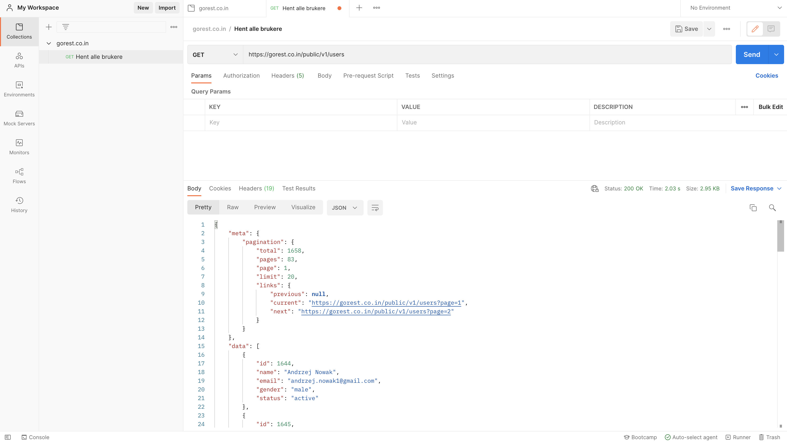

# REST API fra klient-siden

## Repetisjon av Postman

Først skal vi repetere hvordan vi bruker et API med Postman som klient. Vi skal bruke samme API som sist på siden gorest.co.in.

Gå inn på:
```postman.com```
og logg inn med brukeren din.

### Repetisjon: Sette opp collection i Postman

For å holde ting ryddig i postman skal vi opprette en **collection** som skal inneholde alle **requestene** vi skriver.

For å opprette en collection i Postman, trykk på "+" tegnet til høyre for "Collections" knappen:


Den nye collectionen kan du kalle hva du vil, f.eks. "gorest.co.in", som er nettsiden vi skal bruke.

### Repetisjon: Request med GET

Nå skal vi skrive vår første request.

Den enkleste requesten er GET, som vi bruker når vi skal hente informarsjon fra serveren vi snakker med. Vi kan begynne med å hente brukeren for gorest-siden.

Trykk for å legge til en ny request rett under tittelen på den ny kolleksjonen:


Da får vi opp vinduet for å redigere den nye requesten.

Øverst er navnet på requesten. Det er bare for vår egen den for å holde styr på ting. Vi kan kalle denne "Hent alle brukere".

Nedenfor skriver URLen for requesten, vi skal hente ut brukerene i gorest-siden, urlen blir derfor:

```https://gorest.co.in/public/v1/users```


Med alle verdiene satt kan vi trykke på Send-knappen helt til høyre:


Requesten blir da sendt til serveren på den gitte URLen, og postman viser oss svarer vi får tilbake i JSON-format:




### Repetisjon: Request med autentisering

### Repetisjon: Request med POST