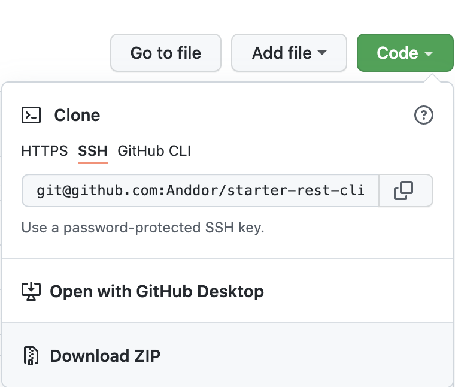

# Nettside som REST API-klient

Vi skal nå kikke på hvordan vi kan bruke en nettside som en klient mot samme REST API.

For å gjøre oppgavene må du laste ned koden til din datamaskin. Bruke gjerne git hvis du husker hvordan. URLen for git finner du ved å trykke på "Code"-knappen, og kopier den inn i `git clone`. Hvis du ikke husker git i farta kan du bruke "Download Zip" funksjonen. 



Åpne `index.html` i en nettleser. Dette er en enkel nettside som fort avslører at jeg ikke er noen designer.

## Hent brukere med javascript

På nettsiden har vi fire knapper, tilhørende de samme fire requestene som vi gjorde i Postman. Requestene for å hente brukere og for å opprette en ny bruker er implementert. Prøv dem ut. Resultatene kommer i ganske stygt format i konsollen (F12).

"Create User" vil gi feilmeldingen "401 Unauthorized" frem til du har kopiert inn access-tokenet inn i index.js. (Det er ikke bra å legge passord og tokens ut på github.)

I `index.js` kan vi se implementasjonen i javascript av de samme requestene som vi gjorde i postman. Vi bruker den innbygde javascript-metoden `fetch()` (for mer info https://developer.mozilla.org/en-US/docs/Web/API/fetch). "Get users" trenger kun to av de fire elementene: URL og metoden "GET". Når vi bruker `fetch()`er urlen første argument (lagret i konstanten `gorestUsers`), og andre argument er et javascript object (et format som ligner på JSON), som her spesifiserer at metoden er "GET".

Responsen fra serveren håndteres av funksjonen som er definert inne i `then()`, vi henter ut json fra svaret med `.json()`, som utløser en ny `then()`, hvor vi tilslutt skriver resultatet til konsollet.

(Istedenfor å skrive resultatet ut til konsoll, ville vi i en ordentlig nettside vi lagt det til HTMLen, for eksempel som en liste)

### Oppgave: hent innlegg

Implementer funksjonen `handleGetPosts()` slik at den henter innlegg fra:

```https://gorest.co.in/public/v1/posts```

## Opprett bruker med javascript

Hvis du ikke har gjort det, lim inn access tokenet i linjen `const token = "PASTE TOKEN HER"` i `index.js`.

Hvis du nå fyller ut skjemaet i `index.html` vil "Send inn" knappen nå opprette en bruker. Sjekk i konsollet at du får tilbake den nyopprettede brukeren slik som i postman.

Create User ser ganske lik ut som get user, men har alle fire elementene i en request. URL som første arguement til `fetch()`, og javascript-objectet har metode, headers og body.

**Headers** ble som nevnt tidligere automatisk opprettet av postman, men i javascript må vi opprette dem selv. En **header** er et par av nøkkel og verdi, litt som JSON. Headeren `Authorization` brukes for å legge ved autorisering, som en token. Et annet eksempel er `Content-Type`, som sier hvilket format innholdet i requesten er på. I dette tilfellet vil servere gjette at innholdet vårt er JSON, men hvis ikke måtte vi satt den til `application/json` for å vise at innholdet vi sender er JSON. 

Vi ser her at javascript kan konvertere en html-form direkte til JSON. Her blir navnet på feltet "name" fra html-formen, og verdi i feltet den tilhørende verdien fra html-formen. Vi kunne også skrevet body eksplisitt slik:
```javascript
fetch(gorestUsers, {
    "method" : "POST",
    "headers": headers,
    "body": {"name": "Andreas", document.getElementById("name") ... }
})
```
Men på denne måten kan vi skrive mindre kode.

### Oppgave: opprett innlegg:

Utvid html-formen `createPostForm` og implementer funksjonen `handleCreatePost()`slik at den oppretter innlegg mot:

```https://gorest.co.in/public/v1/posts```

## Innlevering:

Du skal levere oppgavene i teams. Du kan levere enten en lenke til et github repository (husk å invitere meg om det er et private repository), eller en zip med koden din.

## Bonusoppgave:

Bruk javascript til å generere html utfra responsene fra serveren, og legg inn denne htmlen i nettsiden.
